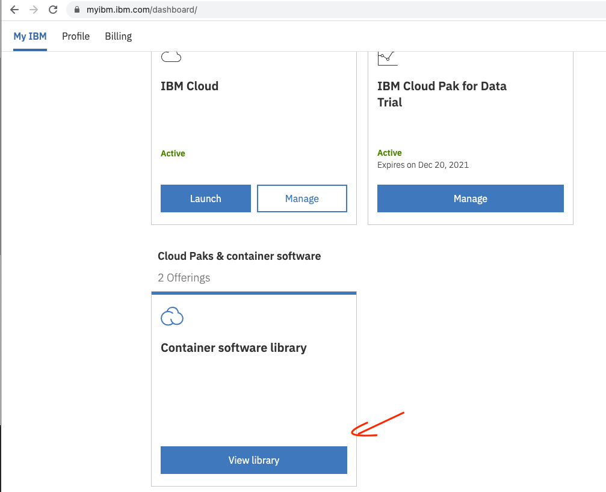
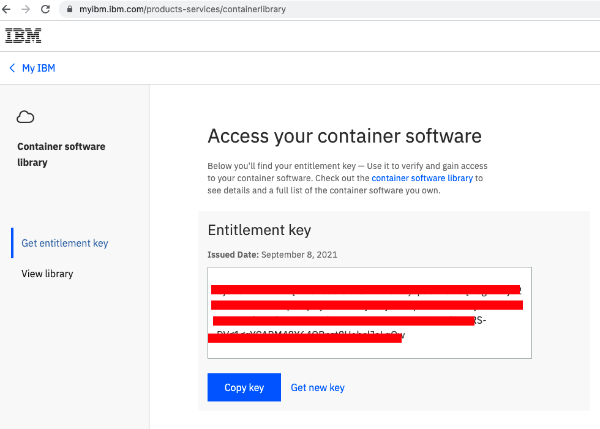
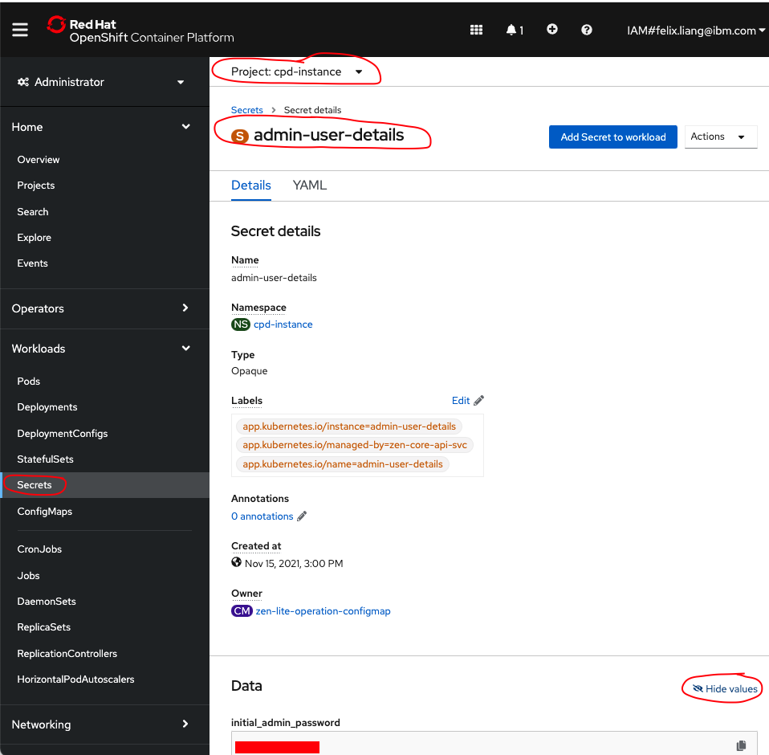

# Install Apps on ROKS Provisioned from TechZone
This guide uses Ansible to install CP4D on ROKS environment provisioned from TechZone. It has been tested on [IBM RedHat Openshift Kubernetes Service (ROKS)](https://techzone.ibm.com/my/reservations/create/60f8223f480cda001e425948), please select 5 work nodes with 32 GB memory.

## Prerequisite
### Install Ansible 
Please find the link [here](https://docs.ansible.com/ansible/latest/installation_guide/intro_installation.html) for installing Ansible.

## Prepare for Installation

### Update varibles

Three variables need to be updated in vars.yml
```
k8s_host: https://c114-e.us-south.containers.cloud.ibm.com:30818
k8s_api_token: sha256~Bid1Y7yCVU2KULJBog4mOvwj76ELn5FfZYAZvRpav5c 
entitlement_key: <your own entitlement key>
```
Above you can see an example of the k8s_host and k8s_api_token, this can be found from Openshift Console.

The entitlement key can be found from your account at https://myibm.ibm.com.






## Run Installation Script
Run the following script to start installing CP4D

```
ansible-playbook 1-install-cp4d.yml
```

This may take about ~1 hour.

## Post Installation

Find the login URL from the Ansible log,

```
TASK [debug] ************************************************************************************************************************
ok: [localhost] => {
    "msg": [
        "The login URL: cpd-cpd-instance.itzroks-663002aumg-aqqxw6-6ccd7f378ae819553d37d5f2ee142bd6-0000.us-south.containers.appdomain.cloud"
    ]
}
```

Login user name is **admin** and password can be found from the command below,

```
oc extract secret/admin-user-details -n cpd-instance --keys=initial_admin_password --to=-
```
You could also find the password thru the Openshift Console


